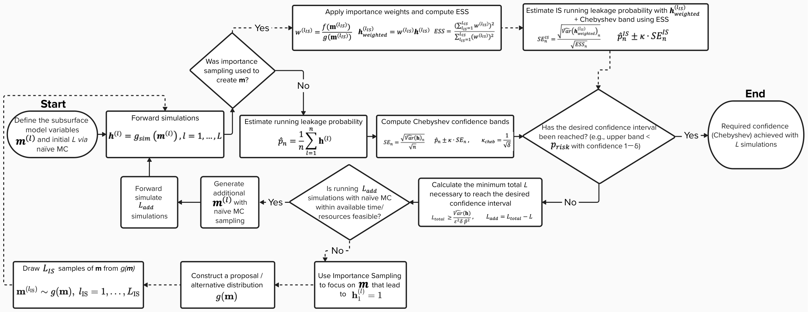
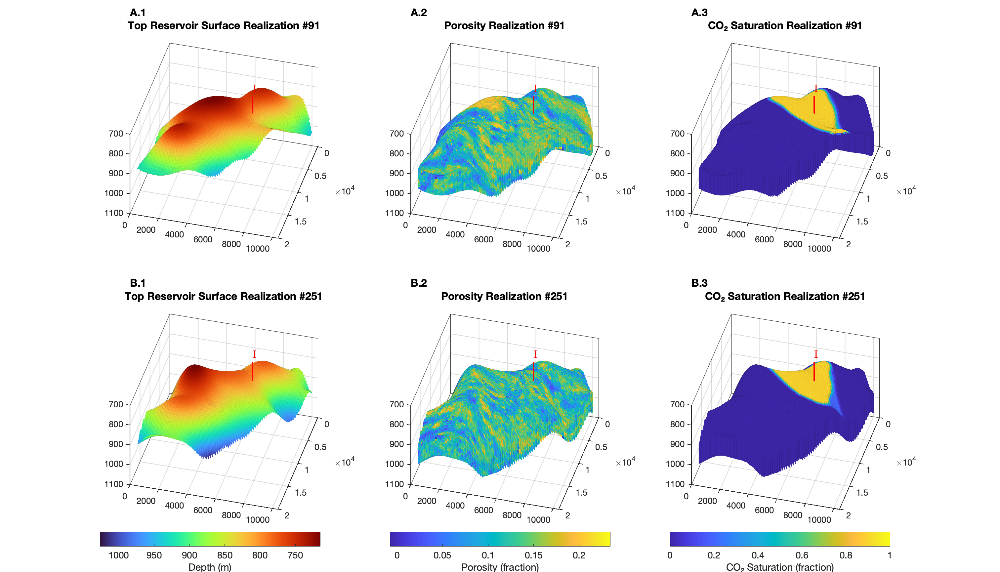

---
# Quantifying CO₂ Leakage Risk when Planning Safe Geological Carbon Storage using Importance Sampling of Failure Probabilities

This repository reproduces the workflow described in the paper  
**_“Quantifying CO₂ Leakage Risk when Planning Safe Geological Carbon Storage using Importance Sampling of Failure Probabilities.”_**

It provides a **reproducible Jupyter-based implementation** of the statistical and computational framework developed to evaluate rare CO₂ leakage events in geological carbon storage (GCS). The workflow integrates **Naïve Monte Carlo (NMC)** simulations, **dimensionality reduction (PCA/DGSA)**, and **Importance Sampling (IS)** to achieve accurate leakage-risk estimates with dramatically fewer forward simulations.

---

## 🧭 Purpose

This project is designed to make the paper’s methodology **transparent and reproducible**.  
It implements all steps:

1. **Naïve Monte Carlo baseline** — loading of reservoir realizations ($m_1$, $m_2$) for top-surface geometry and porosity.  
2. **Dimensionality reduction and sensitivity screening** (PCA + DGSA).  
3. **Construction of IS alternative distribution** $g(\mathbf{m})$ via Multivariate Kernel Density Estimation (MKDE).  
4. **Reconstruction of IS realizations** $m′^{(l)}$ for forward MRST flow simulations.  
5. **Post-simulation weighting and analysis** — computation of importance weights, effective sample size (ESS), and Chebyshev confidence bounds.  

The final output quantifies how many fewer simulations are required by IS to reach the same confidence level as the full Monte Carlo ensemble.

---

## 🧩 Repository Structure

```

GCS_IS_Folder/
├── notebooks/
│   ├── Final_Script_after_Naive_Simulation.ipynb
│   └── Final_Script_after_IS_Simulation.ipynb
│
├── data/
│   └── Inputs_for_Final_Script_after_Naive_Simulation/
│   └── Inputs_for_Final_Script_after_IS_Simulation/
│
├── figures/
│   ├── Fig_1.png
│   ├── Fig_2.png
│   └── Fig_5.png
│
├── GDSA_Light/
│
├── requirements.txt
├── .gitignore
└── README.md
└── .vscode/
└── .gitattributes
└── setup.py

````

---

## ⚙️ How to Run

### 1️⃣ Clone the repository
```bash
git clone https://github.com/sofia-mantilla/GCS_Importance_Sampling_Methodology.git
cd GCS_Importance_Sampling_Methodology
````

### 2️⃣ Install dependencies

```bash
pip install -r requirements.txt
```

### 3️⃣ Launch notebooks

```bash
jupyter lab
```

Run the notebooks in order:

1. **Final_Script_after_Naive_Simulation.ipynb** — pre-IS-simulation setup: PCA, DGSA, MKDE, IS resampling.
2. **Final_Script_after_IS_Simulation.ipynb** — post-IS-simulation weighting, ESS, and Chebyshev confidence analysis.

---

## 📊 Workflow Figure

<p align="center">
  
</p>

**Figure 1. (#2 in paper) Workflow for estimating CO₂ leakage probability with Naïve Monte Carlo (MC) and Importance Sampling (IS).**
The process begins with generating an initial batch of subsurface model realizations **m⁽ˡ⁾** via naïve MC. Each realization is forward simulated to obtain prediction variables **h⁽ˡ⁾**, from which the running leakage probability **p̂ₙ** and Chebyshev confidence bands are computed. If the desired confidence interval relative to the prescribed safety threshold **p_risk** is not reached, evaluate whether additional naïve MC simulations (**L_add**) are feasible. If not, IS is applied by constructing an alternative distribution **g(m)** that focuses sampling on leakage-prone scenarios (**h₁⁽ˡ⁾ = 1**). IS samples are reweighted to recover unbiased estimates, and the effective sample size (ESS) is tracked in the subsequent stage.

---

## 📈 Pipeline Overview

| Step | Description                                                                                                                                                                                                          | Status            |
| ---- | -------------------------------------------------------------------------------------------------------------------------------------------------------------------------------------------------------------------- | ----------------- |
| 1    | Load model inputs sampled by Naïve Monte Carlo (**m₁: top surfaces**, **m₂: porosity**)                                                                                                                              | Final_Script_after_Naive_Simulation.ipynb|
| 2    | Load failure/no failure outcomes **h₁⁽ˡ⁾** obtained from forward simulations                                                                                                                                         | Final_Script_after_Naive_Simulation.ipynb|
| 3    | Estimate running failure probability and compute Chebyshev confidence bands                                                                                                                                          | Final_Script_after_Naive_Simulation.ipynb|
| 4    | Estimate required number of simulations using Chebyshev’s Inequality and check if the confidence interval relative to the prescribed safety threshold **p_risk** has been reached with the initial **L** simulations | Final_Script_after_Naive_Simulation.ipynb|
| 5    | Check if Importance Sampling (IS) is necessary                                                                                                                                                                       | Final_Script_after_Naive_Simulation.ipynb|
| 5.1  | Apply PCA on **m₁** and **m₂** to reduce dimensionality                                                                                                                                                              | Final_Script_after_Naive_Simulation.ipynb|
| 5.2  | Perform DGSA on PCA scores to identify sensitive components                                                                                                                                                          | Final_Script_after_Naive_Simulation.ipynb|
| 5.3  | Fit MKDE (Multivariate Kernel Density Estimation) on sensitive PC scores to construct the IS alternative distribution **g(m)**                                                                                       | Final_Script_after_Naive_Simulation.ipynb|
| 5.4  | Resample new PC scores from IS alternative distribution **g(m)**                                                                                                                                                     | Final_Script_after_Naive_Simulation.ipynb|
| 5.5  | Reconstruct model variables (**m₁′**, **m₂′**) with the resampled PC scores                                                                                                                                          | Final_Script_after_Naive_Simulation.ipynb|
| 6    | Compute IS weights                                                                                                                                                                                                   | Final_Script_after_IS_Simulation.ipynb |
| 7    | Estimate IS running leakage probability and Chebyshev band using ESS                                                                                                                                                 | Final_Script_after_IS_Simulation.ipynb |
| 8    | Check if desired confidence interval relative to the prescribed safety threshold **p_risk** has been reached                                                                                                         | Final_Script_after_IS_Simulation.ipynb |

---

### Example of the Reservoir's Structural and Porosity Realizations

<p align="center">
  
</p>

**Figure 2. (#1 in paper)** Example reservoir model realizations used to evaluate CO₂ leakage risk.  
Panels show variations in **top-surface structure** and **porosity** across different Naïve Monte Carlo (MC) samples.  
These realizations are the **inputs** to MRST flow simulations that produce leakage/saturation outcomes; this notebook analyzes those **simulation outputs** rather than executing the simulations themselves.

---

## 📉 Results and Comparison

The IS ensemble achieves the same confidence level as the full Monte Carlo analysis while requiring an order of magnitude fewer forward simulations.

<p align="center">
  
</p>

**Figure 3. (# 5 in paper) Convergence of Naïve Monte Carlo vs IS-weighted leakage probability with Chebyshev confidence bands.**
Blue shaded regions represent NMC confidence bounds, while the purple region shows IS uncertainty convergence.
IS reaches the prescribed safety confidence threshold using **~8× fewer simulations**.

---

## 📦 Data

Input files required to reproduce the workflow are located in:
`data/Inputs_for_Final_Script_after_IS_Simulation/` and `data/Inputs_for_Final_Script_after_Naive_Simulation/`.

---

## 📚 Citation

If you use this repository, please cite:

> **Mantilla-Salas, S. et al. (2025).**
> *Quantifying CO₂ Leakage Risk when Planning Safe Geological Carbon Storage using Importance Sampling of Failure Probabilities.*

---

## 👩‍🔬 Author and License

**Author:** Sofia Mantilla Salas
**Affiliation:** Stanford University — Doerr School of Sustainability - Mineral X

📧 **Email:** [sofiams@stanford.edu](mailto:sofiams@stanford.edu)
🔗 **GitHub:** [sofia-mantilla](https://github.com/sofia-mantilla)

License: MIT — Free to use, adapt, and share with attribution.
