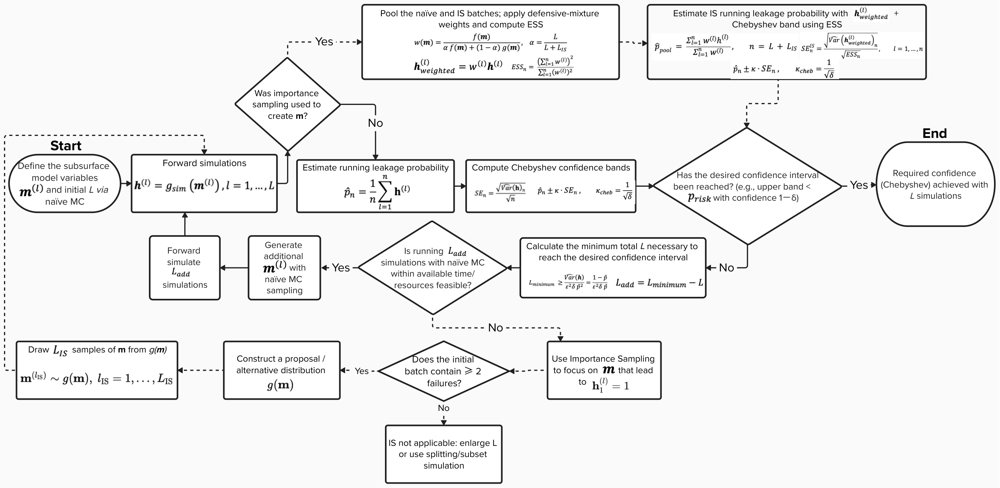
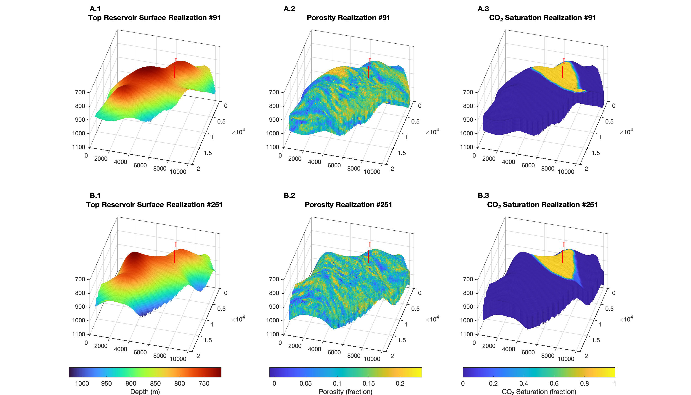
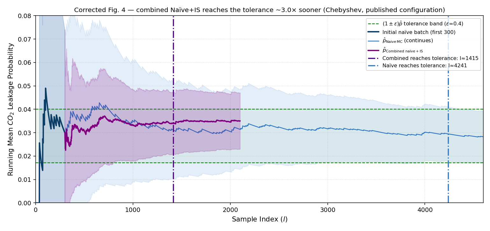

[](https://doi.org/10.5281/zenodo.17480588)
---
# Importance Sampling for Low Probability Event Estimation under Spatial Uncertainty: Application to Estimating CO₂ Leakage Risk in Carbon Capture and Sequestration


> ## Version 2 (2026)
> Version 2 revises the importance-weight computation (joint densities evaluated at the
> sampled points) and adds a defensive-mixture combined estimator with weights bounded by
> 1/α, a 25-replicate replication study, stress tests, and a rare-regime
> re-threshold experiment; the corrected pipeline was additionally validated with six
> fresh out-of-sample MRST batches (protocol and results in the paper's Appendix C). The canonical workflow is `Final_Script_after_IS_Simulation_CORRECTED.ipynb`
> together with `revision_tools.py`; the v1 notebook is retained for archival completeness
> and its analysis is superseded by this version.
> Headline results: the 95% certification guarantee was never violated across 25
> independent replicates and 6 fresh out-of-sample MRST validation batches; the typical
> certification-cost advantage over naïve Monte Carlo is **≈1.5–2×** at the studied risk
> margin, growing as the margin tightens or the event becomes rarer.
> See `RELEASE_NOTES_v2.md` for the changelog and the paper for details.

---

This repository reproduces the open-source workflow accompanying the paper  
**_“Importance Sampling for Low Probability Event Estimation under Spatial Uncertainty: Application to Estimating CO₂ Leakage Risk in Carbon Capture and Sequestration.”_**

It provides a **reproducible Jupyter-based implementation** of a methodology for **importance sampling under spatial uncertainty**, designed for cases where uncertain inputs are **high-dimensional spatial fields** rather than low-dimensional parameter vectors. The workflow combines **Naïve Monte Carlo (NMC)**, **PCA-based dimensionality reduction**, **DGSA sensitivity screening**, **MKDE-based proposal construction**, and **importance weighting with Chebyshev confidence bounds** to estimate rare-event probabilities more efficiently.

---

## 🧭 Purpose

This project is designed to make the paper’s methodology **transparent and reproducible**.  
It implements all steps:

1. **Naïve Monte Carlo baseline** — loading of reservoir realizations ($m_1$, $m_2$) for top-surface geometry and porosity.  
2. **Dimensionality reduction and sensitivity screening** (PCA + DGSA).  
3. **Construction of IS alternative distribution** $g(\mathbf{m})$ via Multivariate Kernel Density Estimation (MKDE).  
4. **Reconstruction of IS realizations** $m′^{(l)}$ for forward MRST flow simulations.  
5. **Post-simulation weighting and analysis** — computation of importance weights, effective sample size (ESS), and Chebyshev confidence bounds.  

The final output quantifies how many fewer simulations are required by the combined naïve+IS estimator to certify the leakage probability below a prescribed risk threshold, reported as a distribution across replicates rather than a single run.

---

## 🧩 Repository Structure

```

GCS_IS_Folder/
├── notebooks/
│   ├── Final_Script_after_Naive_Simulation.ipynb        (step 1 — naïve batch, PCA, DGSA, MKDE, IS resampling)
│   ├── Final_Script_after_IS_Simulation_CORRECTED.ipynb (step 2, v2 — canonical weighting & certification)
│   ├── Final_Script_after_IS_Simulation.ipynb           (v1 — superseded; see note in its first cell)
│   ├── revision_tools.py            (corrected weights, defensive mixture, variance report, bounds)
│   ├── check_corrected_weights.py   (5-second sanity check of the weight computation)
│   ├── seed_study.py                (25-replicate × batch-size study)
│   ├── seed_study_results.csv       (its output)
│   ├── stress_tests.py              (t1–t9: coverage, bounds, weight-sanity identity, …)
│   ├── task8_rare_regime.py         (re-threshold test at p ≈ 10⁻³)
│   ├── test_dgsa_selection.py       (h₁-only vs h₁+h₂ DGSA screening)
│   └── synth_rerun_final.py         (synthetic illustrative example, fixed seeds)
│
├── data/                            (stored with Git LFS — see How to Run)
│   ├── Inputs_for_Final_Script_after_Naive_Simulation/
│   └── Inputs_for_Final_Script_after_IS_Simulation/
│
├── figures/                         (workflow, realizations, and corrected result figures)
├── DGSA_Light/                      (distance-based global sensitivity analysis package)
├── requirements.txt
├── setup.py
├── CITATION.cff
├── RELEASE_NOTES_v2.md
├── LICENSE.txt
└── README.md
````

---

## ⚙️ How to Run

### 1️⃣ Clone the repository
The `data/` files are stored with **Git LFS**, so install it once before cloning
(`brew install git-lfs` on macOS or `apt install git-lfs` on Linux, then `git lfs install`).
If you cloned without it, run `git lfs pull` inside the repo to fetch the data.

```bash
git clone https://github.com/sofia-mantilla/GCS_Importance_Sampling_Methodology.git
cd GCS_Importance_Sampling_Methodology
````

### 2️⃣ Install dependencies

```bash
pip install -r requirements.txt
```

### 3️⃣ Launch notebooks

```bash
jupyter lab
```

Run the notebooks in order:

1. **Final_Script_after_Naive_Simulation.ipynb** — pre-IS-simulation setup: PCA, DGSA, MKDE, IS resampling.
2. **Final_Script_after_IS_Simulation_CORRECTED.ipynb** — post-IS-simulation weighting (corrected), defensive-mixture combined estimator, ESS, and Chebyshev confidence analysis.

Quick verification that the toolbox works (~5 s, checks the weight computation and mixture estimator):

```bash
cd notebooks && python check_corrected_weights.py
```

---

## 📊 Workflow Figure

<p align="center">
  
</p>

**Figure 1 (Fig. 2 in the paper). Workflow for estimating CO₂ leakage probability with Naïve Monte Carlo (MC) and Importance Sampling (IS).**
The process begins with generating an initial batch of subsurface model realizations **m⁽ˡ⁾** via naïve MC. Each realization is forward simulated to obtain prediction variables **h⁽ˡ⁾**, from which the running leakage probability **p̂ₙ** and Chebyshev confidence bands are computed. If the desired confidence interval relative to the prescribed safety threshold **p_risk** is not reached, evaluate whether additional naïve MC simulations (**L_add**) are feasible. If not, IS is applied by constructing an alternative distribution **g(m)** that focuses sampling on leakage-prone scenarios (**h₁⁽ˡ⁾ = 1**). IS samples are reweighted to recover consistent estimates of the target distribution, and the effective sample size (ESS) is tracked in the subsequent stage. The importance weights use the defensive mixture g′ = αf + (1−α)g over the pooled naïve and IS sample (Eq. 13 in the paper); the effective sample size, standard error and combined estimate are computed over that pooled sample (Eqs. 17, 18 and 32); and a batch-size feasibility rule gates the IS branch.

---

## 📈 Pipeline Overview

| Step | Description                                                                                                                                                                                                          | Notebook          |
| ---- | -------------------------------------------------------------------------------------------------------------------------------------------------------------------------------------------------------------------- | ----------------- |
| 1    | Load model inputs sampled by Naïve Monte Carlo (**m₁: top surfaces**, **m₂: porosity**)                                                                                                                              | Final_Script_after_Naive_Simulation.ipynb|
| 2    | Load failure/no failure outcomes **h₁⁽ˡ⁾** obtained from forward simulations                                                                                                                                         | Final_Script_after_Naive_Simulation.ipynb|
| 3    | Estimate running failure probability and compute Chebyshev confidence bands                                                                                                                                          | Final_Script_after_Naive_Simulation.ipynb|
| 4    | Estimate required number of simulations using Chebyshev’s Inequality and check if the confidence interval relative to the prescribed safety threshold **p_risk** has been reached with the initial **L** simulations | Final_Script_after_Naive_Simulation.ipynb|
| 5    | Check if Importance Sampling (IS) is necessary                                                                                                                                                                       | Final_Script_after_Naive_Simulation.ipynb|
| 5.1  | Apply PCA on **m₁** and **m₂** to reduce dimensionality                                                                                                                                                              | Final_Script_after_Naive_Simulation.ipynb|
| 5.2  | Perform DGSA on PCA scores to identify sensitive components                                                                                                                                                          | Final_Script_after_Naive_Simulation.ipynb|
| 5.3  | Fit MKDE (Multivariate Kernel Density Estimation) on sensitive PC scores to construct the IS alternative distribution **g(m)**                                                                                       | Final_Script_after_Naive_Simulation.ipynb|
| 5.4  | Resample new PC scores from IS alternative distribution **g(m)**                                                                                                                                                     | Final_Script_after_Naive_Simulation.ipynb|
| 5.5  | Reconstruct model variables (**m₁′**, **m₂′**) with the resampled PC scores                                                                                                                                          | Final_Script_after_Naive_Simulation.ipynb|
| 6    | Compute IS weights                                                                                                                                                                                                   | Final_Script_after_IS_Simulation_CORRECTED.ipynb |
| 7    | Estimate IS running leakage probability and Chebyshev band using ESS                                                                                                                                                 | Final_Script_after_IS_Simulation_CORRECTED.ipynb |
| 8    | Check if desired confidence interval relative to the prescribed safety threshold **p_risk** has been reached                                                                                                         | Final_Script_after_IS_Simulation_CORRECTED.ipynb |

---

### Example of the Reservoir's Structural and Porosity Realizations

<p align="center">
  
</p>

**Figure 2 (Fig. 1 in the paper).** Example reservoir model realizations used to evaluate CO₂ leakage risk.  
Panels show variations in **top-surface structure** and **porosity** across different Naïve Monte Carlo (MC) samples.  
These realizations are the **inputs** to MRST flow simulations that produce leakage/saturation outcomes; this notebook analyzes those **simulation outputs** rather than executing the simulations themselves.

---

## 📉 Results and Comparison

Across 25 independent replicates, the combined naïve+IS estimator certifies the leakage probability below the risk threshold with a median **≈1.6×** lower total simulation cost than naïve Monte Carlo (≈1.5–2× band; up to ≈3× for favourable batches), with the 95% certification guarantee never violated. The figure below shows the running-mean comparison for the anchor configuration (`figures/Fig4_corrected.png`); the originally archived `figures/Fig_5.png` reflects the v1 analysis and is superseded.

<p align="center">
  
</p>

**Figure 3 (cf. Fig. 8b in the paper). Convergence of naïve Monte Carlo vs the combined naïve+IS estimator with Chebyshev confidence bands (anchor configuration).**
The combined estimator reaches the tolerance at n ≈ 1,415 versus n ≈ 4,241 for naïve MC in this favourable single run, quoted only as an anchor; the replicate-median advantage is ≈1.5–2× at the studied margin.

---

## 📦 Data

Input files required to reproduce the workflow are stored with Git LFS and located in:
`data/Inputs_for_Final_Script_after_IS_Simulation/` and `data/Inputs_for_Final_Script_after_Naive_Simulation/`.

---

## 📚 Citation

If you use this repository or reproduce any part of the workflow, please cite:

> **Mantilla Salas, S., Kloeckner, J., Yin, D. Z., Zechner, M., & Caers, J. (2026), version 2.**
> *Importance Sampling for Low Probability Event Estimation under Spatial Uncertainty: Application to Estimating CO₂ Leakage Risk in Carbon Capture and Sequestration.*
> **Zenodo.** [](https://doi.org/10.5281/zenodo.17480588)

---

## 👩‍🔬 Author and License

**Author:** Sofia Mantilla Salas
**Affiliation:** Stanford University — Doerr School of Sustainability - Mineral X

📧 **Email:** [sofiams@stanford.edu](mailto:sofiams@stanford.edu)
🔗 **GitHub:** [sofia-mantilla](https://github.com/sofia-mantilla)

License: MIT — Free to use, adapt, and share with attribution.
